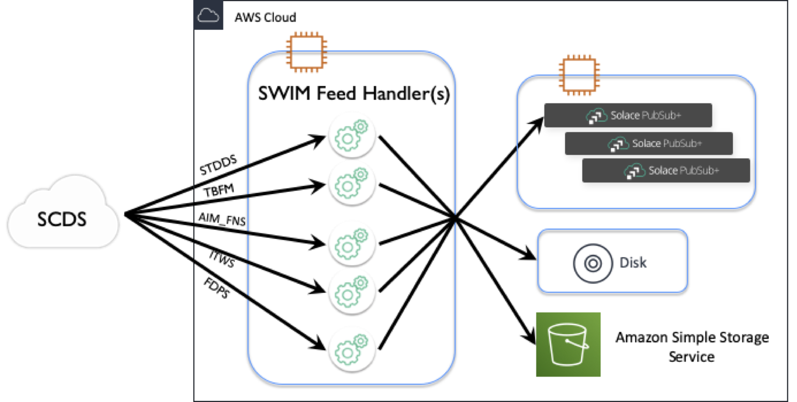

# SWIM Feed Handler

This project provides an application that allows a user to consume US System Wide Information 
Management (SWIM) data.

## Contents
* [Overview](#overview)
* [Using the Application](#using-the-application)
* [License](#license)
* [Resources](#resources)


---

## Overview

As stated, this project provides a Spring Boot Auto-Configuration that consumes from the 
SWIM Cloud Distribution Service (SCDS) and then handles the message via lightweight Spring
Integration services implemented for a specific purpose.

---

## Using the Application

The application uses Spring Boot, Spring Integration and Solace JMS with Spring.  The 
SCDS connection feed requires usage of JNDI to lookup various objects including connection
factory and queue names.  The application provides a set of services to handle the data
once consumed.  

Other services included are a FileOutputService, which writes consumed messages to
the file system, and an AWS Simple Storage Service (S3), which writes the payload of the 
consumed messages to S3 as a string, a Message Logging service that writes messages to a single
message log while rotating every hour and a NullOp service that discards the message upon receipt.
  


The services are disabled by default and show how the processing of the message
can be extended (e.g. writing the data to a database).

To use the application perform the following steps:
1. [Update application properties](#1-update-the-applicationproperties)
2. [Build/Package/Deploy the application](#2--buildpackagedeploy-the-application)
3. [Run the application](#3--run-the-application)

### 1. Update the application.properties
The application.properties file provides connection properties for both consumer and producer
connections.  Consumer properties are to connect to SCDS.  Producer properties are to
connect to your managed Solace broker either on premise or cloud based.  The property files 
can be found in the ```config/``` directory.

Passwords can be obfuscated in the property files.  Please refer to [Section 4](#4.--property-password-obfuscation) for
instructions on how to obfuscate data in the property files.

#### 1.1 Consumer connection
SCDS provides connection information when you create a subscription.  Currently each data
type available via SCDS is provided in a separate Message VPN.  We have provided a set
of application properties files, one for each of the data types and known Message VPNs.

When a subscription is created in SCDS, a set of connection information is provided once
the subscription is approved.  Using the connection information provided through the SCDS
portal update the consumer connection properties

```properties
solace.jms.consumer.host=tcps://[host]:[port]  (SCDS property: JMS Connection URL)
solace.jms.consumer.msg-vpn=[messageVPN]  (i.e. STDDS, FDPS, ITWS)
solace.jms.consumer.client-username=[username]]  (SCDS property: Connection Username)
solace.jms.consumer.client-password=[password] (SCDS property: Connection Password)
solace.jms.consumer.connection-factory=[connection-factory]  (SCDS property: Connection Factory i.e. usually in format of username.CF)

solace.jms.consumer.queue-name.0=[queue-name]  (SCDS property: Queue Name i.e. format of username.MESSAGE_VPN.UUID.OUT)
```
Sometimes it will be necessary to create multiple connections to a single Message VPN to connect
to multiple queues due to data rates or specific filter needs.  For example, the STDDS data rate 
is one of the highest data rates provided by SCDS.  It may be necessary to separate the data into
different subscriptions with different filters, thus creating multiple subscriptions and an 
associated queue.

The application.properties file can support multiple queue configurations.  Simply use a zero based
index for the Queue name property.  The following is an example of multiple queues from the same 
VPN.
```properties
solace.jms.consumer.queue-name.0=[queue 1 name]
solace.jms.consumer.queue-name.1=[queue 2 name]
solace.jms.consumer.queue-name.2=[queue 3 name]
...
solace.jms.consumer.queue-name.n=[queue n+1 name]
```
The consumer code is multi-threaded.  The property `solace.jms.consumer.maxListeners` provides
a mechanism to limit the number of threads that are dedicated to consuming messages from the SCDS
queue.  The SFH was tested in an AWS environment using a t3a.micro sized EC2 and each data type has
default values and should be sufficient for most of the SCDS flows.  Your specific scenario might 
warrant increase in this values.  This will likely be a trial
and error scenario.  Monitor to the SCDS metric of expired messages to determine if the value
should increase or decrease.

#### 1.2 Service configuration
There are various message handling services that are provided.  Each service has a unique function and 
can be executed independently of each other.  The idea is that as the messages are consumed, they are 
handed off to 1 to n number of handler services via a publish/subscribe subscribe.  If multiple services
are enabled `service.x.enabled=true` then each message will be processed in parallel.  The property 
`service.max-thread-count` will need to be increased to handle the workload of multiple services.

The following is a list of services that have been provided.
* [Solace Publishing Service](###1.2.1-solace-publishing-service)
* [File Output Service](###1.2.2-file-output-service)
* [Message Logging Service](###1.2.3-message-logging-service)
* [AWS S3 Put Service](###1.2.4-AWS-S3-Put-Service)
* [Null Op Service](###1.2.5-null-op-service)

New services can be created as needed.  Refer to the [Spring Integration Project](https://docs.spring.io/spring-integration/docs/5.2.6.RELEASE/reference/html/)
for reference documentation on `@Service`, `@ServiceActivator` and `@MessageEndpoint` annotations.

##### 1.2.1 Solace Publishing Service
The purpose of this service is to publish messages back into a Solace PS+ instance.  The idea is that 
you may run multiple clients within your organization that
consume data from the US SWIM feed.  By running the SWIM Feed Handler, you can create
and manage a consumer (may require multiple instances depending on subscriptions) that consumes
the data vs. each client making a connection to SCDS.  This saves bandwidth on both 
SCDS' egress and your organization's ingress.  By publishing to a local Solace PS+ instance
you have more flexibility in your client data needs using built in Solace broker capabilities
including protocol choices, enhanced filter capabilities and your choice of programming 
languages.

See [Getting started with Solace PubSub+ Standard Edition](https://solace.com/products/event-broker/software/getting-started/)
for more information on how to standup a Free instance of Solace PubSub+ event broker.

Similar to the consumer configuration properties, there are configuration properties needed
for publication into your instance of a Solace Broker.  Provide the following properties for
the publishing service.
```properties
service.solace-publishing.host=[protocol]://[host]:[port]  (i.e. tcp://localhost:55555)
service.solace-publishing.msg-vpn=[messageVPN]   (i.e. default)
service.solace-publishing.client-username=[username]
service.solace-publishing.client-password=[password]
```

##### 1.2.2 File Output Service
This service simply writes each message to disk using the unique message id as the file name.  An optional
parameter of `service.file-output.write-headers`  is a true/false value telling the service to
write the message headers as well to disk.  The file containing the headers will included an extension
`.header`.

The property `service.file-output.directory` is the path to which the service will write each file.
This path is relative to the program execution directory.  If needed, a symbolic link can be used to store
the files to a separate location.

##### 1.2.3 Message Logging Service
This service logs each message in a rolling log file.  The service uses the rolling file appender from the
[Logback Project](http://logback.qos.ch/) to perform an hourly rollover.  At the end of each hour, the previous
hours log w/ messages and optional headers, are then archived into a simple zip file.

To modify the logging behavior, the `logback.xml` file in `src/main/java/resources` contains the source
of the logging command that rolls over the file every hour.  You can modify the following for both rollover behavior
 and the format of the logged message, if desired.  Refer to Logback's documentation for syntax.
```xml
<appender name="hourlyRolloverLogger" class="ch.qos.logback.core.rolling.RollingFileAppender" >
        <file>${basePath}/messages-${spring.profiles.active}.log</file>
        <rollingPolicy class="ch.qos.logback.core.rolling.TimeBasedRollingPolicy">
            <fileNamePattern>${basePath}/messages-${spring.profiles.active}.%d{yyyy-MM-dd_HH, UTC}Z.zip</fileNamePattern>
        </rollingPolicy>
        <param name="Append" value="false" />
        <encoder>
            <pattern>%msg%n</pattern>
        </encoder>
    </appender>
```
If modified, you will need to build, package and deploy the application once again.  Refer to Section 2.

The property `service.message-logging.header-remove-list` is a comma separated list of headers that you
do not want to log.  It can support a `*` for wildcard matching.  The following is an example

```properties
service.message-logging.header-remove-list=jms*,*JMS*,solace*,Solace*,breadcrumbId,req_method,uri
```

##### 1.2.4 AWS S3 Put Service
A simple service to put the contents of the message as a String object into an AWS Simple Storage Service (S3) bucket.
The service requires AWS Security Credentials w/ recommendation of AmazonS3FullAccess permissions.  

Identify the targeted bucket via the property `service.aws-s3-put.bucket-name`.

An optional parameter `service.aws-s3-put.folder-name` can be used to create folders under the bucket.  Multiple
levels of folders can be defined.  Each folder sub-level should be separated by a `/` character.

##### 1.2.5 Null Op Service
This service simply discards the messages upon receipt.  The idea of this service is to provide a mechanism to test
the consumption rate.  By linking the consumer and the null op service together, along with monitoring the Expired
 Message metric from the SCDS portal, this can provide insight into if your current bandwidth can sustain the needed
 message consumption rate.

---

### 2.  Build/Package/Deploy the application
Build the project from source using Maven.

```shell script
mvnw clean package
```

Upon successful completion, a compressed tar file (`swim-feed-handler-VERSION.tar.gz`) will be generated in the 
`target` subdirectory.  Copy the file to the final system and extract the contents with the following
command:

```shell script
tar zxvf swim-feed-handler-VERSION.tar.gz
```

---

### 3.  Run the application
#### 3.1 Options
##### 3.1.1 From command line
After deployment, run the application using the following command:

```shell script
java -jar swim-feed-handler-VERSION.jar --spring.profiles.active=profile-name --spring.config.location=./config/
```

The value for `profile-name` is based on the which application properties file is desired to be loaded into the 
application.  The name of the properties files are in the format of `application-PROFILE-NAME.properties` where 
```PROFILE-NAME``` is typically mappped to an SCDS dataset.  This is done to allow users to run multiple instances
of the application, one for each SCDS dataset/Message VPN.  For example, to run a configuration to consume STDDS
data, run:

 ```shell script
 java -jar swim-feed-handler-VERSION.jar --spring.profiles.active=stdds --spring.config.location=./config/
 ```
 
 This will invoke the properties found in the `config/application-stdds.properties` file.
 
 ##### 3.1.2 From Maven
 The application may also be run from the development environment using Maven.  After
 
 ```shell script
 mvnw spring-boot:run -Dspring-boot.run.profiles=profile_name
 ```
 
 ##### 3.1.3 From IDE
 You can run the application from your IDE of choice.  To run from you IDE, create a Run Configuration and
 add `-Dspring.profiles.active=profile-name` to the VM options of the run command, replacing `profile_name`
 with the desired application properties you want loaded.
 
 It is recommended to create a Run Configuration for each dataset you desire to consume and process.  This 
 allows you to run multiple instances at the same time without the need to change the parameters for each
 execution.
 
 #### 3.2 Monitor
 Log entries are written to `log/system.log` that indicate current processing actions.  Basic information
 is provided on execution and should be sufficient to indicate health of the application.  Additional
 debug messages may be turned on by modifying the root log level from `info` to `debug` in the
 `resources/logback.xml` log configuration file.
 
 ---
 
 ### 4.  Property Password Obfuscation
 Obfuscating passwords in property files is now supported.  The application uses [JASYPT](http://www.jasypt.org/), 
 a very popular library for encryption/decryption of critical information like passwords. 
 
 #### 4.1 Encrypt your critical information
 Any piece of information should be able to be encrypted.  After extracting the tar file from [Section 2](#2--buildpackagedeploy-the-application), 
 
 From a terminal, run the command
 
 ```shell script
 java -cp ext/jasypt-1.9.3.jar org.jasypt.intf.cli.JasyptPBEStringEncryptionCLI verbose=false algorithm=PBEWITHHMACSHA512ANDAES_256 ivGeneratorClassName=org.jasypt.iv.RandomIvGenerator password=<secret-key-used-to-encrypt> input=<password-wanting-to-protect>
 ```
 
 The output should be your password hashed.  Example
 
`k1AwOd5XuW4VfPQtEXEdVlMnaNn19hivMbn1G4JQgq/jArjtKqryXksYX4Hl6A0e`

#### 4.2 Adding the encrypted key into application.properties
Using the output from above, you can now use the value in the property file by wrapping the hash using `ENC(<encrypted key here>)` 
text.  For example,

`solace.jms.consumer.client-password=ENC(k1AwOd5XuW4VfPQtEXEdVlMnaNn19hivMbn1G4JQgq/jArjtKqryXksYX4Hl6A0e)`

Jasypt reads all the properties from application.properties or any classpath properties that you passed. You can 
secure anything you want.  You just need to use prefix ENC( and suffix ) and pass the encrypted key.

#### 4.2 Provide Secret Key to Application
The secret key used to encrypt the password is now needed by the application to decrypt the password.  There are 
many ways to pass the secret key while starting spring boot

If using Maven,  `mvnw spring-boot:run -Dspring-boot.run.profiles=profile_name -Djasypt.encryptor.password=secretkey`.

If using command line, `export JASYPT_ENCRYPTOR_PASSWORD=secretkey` and then run the application as defined in 
[Section 3.1](#3.1.1-From-command-line).

If using an IDE, add `-Djasypt.encryptor.password=secretkey` to the VM arguments of your Run Configuration.

---

## License

This project is licensed under the Apache License, Version 2.0. - See the [LICENSE](LICENSE) file for details.

## Resources

For more information try these resources:

- To get access to [SWIM](https://www.faa.gov/air_traffic/technology/swim/products/get_connected/) data 
- The Solace Developer Portal website at http://solace.dev
- Check out the [Solace blog](http://dev.solace.com/blog/) for other interesting discussions around Solace technology
- Ask the [Solace community.](http://dev.solace.com/community/)


